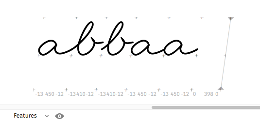
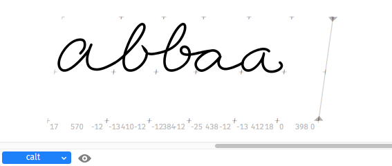
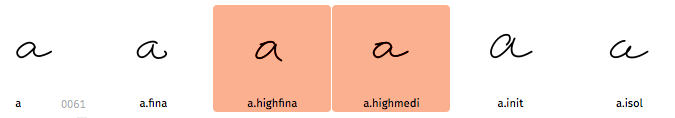
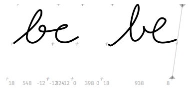

# Build positional calt feature for coursive type

Glyphs script, based on mekkablues script ›Build positional calt feature.py‹, part of mekkablues [Glyphs Scripts][1] with added code for glyphs with ›high connections‹.

## Disclaimer

Basically, I can’t programm. 
So, the additions I made to the original script are all but elegant or professional. 
To be honest, for me it works, but I can’t even say exactly why.

Please be cautious, _use a copy of your font_ and don’t blame me, if anything goes wrong.

## Original Script

Basically the original script builds code for a calt-feature, that changes glyphs to its isolated, initial, medial and final counterpart (glyphs with `.isol`, `.init`, `.medi` and `.fina` suffix).

With the calt-feature inactive, only the bas glyph is used:


With active calt-feature all glyphs are substituted by their matching positional counterpart:

In this case: `a.isol` `space` `a.init` `a` `a.fina`


For a detailled explanation please read [Features, Part 4][2] on the Glyphs Blog.

## Why change this script?

In cousive script, there are letters, that can _only_ connect to the next letter at about x-height. 
For these letters, you need matching subsequent glyphs. 

Depending on the actual handwriting, this is the case for b, o, r, v, w:


With the amended calt-feature active, the second ›b‹ and the second ›a‹ connect nicely to their preceding glyph:


## Basic concept

I assume, you read the aforementioned [blog post][2]. 

In addition to the (up to) five variants (`basic glyph`, `.isol`, `.init`, `.medi`, `.fina`), you need two more variants, that can connect to a high-ending glyph. One in the middle of a word (I suffixed it with `.highmedi`) and one, that can do so at the end of a word (`.highfina`). 


Every letter following a high connecting letter gets substituted with its `.highmedi` counterpart. – Or `.highfina`, in case that letter is the last letter in a word. 

This means, you need these additional forms for each letter that can follow one of the high connecting letters (like b, o, r, v, w). I would suggest building them for every letter. 


## How to find the ›high connecting‹ glyphs?

Easy. For every high connecting glyph you create a new glyph with a `.high` suffix. 
This glyph is not actually used, it is only needed, to generate the necessary letter classes. 


## Ligatures

Some letter combinations do not work well together. 
In the case of my font `b` `e` is a combination that does not work well:



So I created an `b_e` ligature (right), that works better. 

This (and any other) ligature is treated lake any other glyph. 
If it has the described positional alternates, they are substituted as any other glyph. 


There’s one caveat: The ligature must be in place, _before_ the positional alternates are substituted. This means the substitution code for the ligatures has to go to the beginning of the calt feature: 

```
# LIGATURES

sub b e by b_e;

# END LIGATURES


# BEGIN POSITIONAL ALTERNATES

lookup IsolForms {
	ignore sub @isolDef' @AnyLetter, @AnyLetter @isolDef';
	sub @isolDef' by @isolSub;
} IsolForms;

...
```

As of now, you have to do this by hand. Im planning on integrating this to the script.

I disable the dlig feature, as glyphs would otherwise automatically generate dlig feature code. This ligatures are not discretionary, on the contrary they are an integral part of the calt feature. 

## Wow to run the script?

As any glyphs script: Place it in the scripts folder, refresh the Script menu and select 
`Build positional calt feature for coursive type` from the menu.


[1]: https://github.com/mekkablue/Glyphs-Scripts
[2]: https://glyphsapp.com/tutorials/features-part-4-positional-alternates